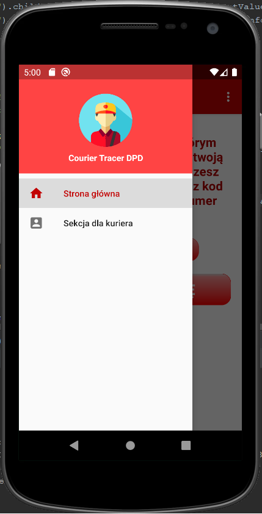

# Courier Tracer
> App for tracing DPD couriers with packages in Poland

## Table of contents
* [General info](#general-info)
* [Screenshots](#screenshots)
* [Technologies](#technologies)
* [Setup](#setup)
* [Features](#features)
* [Status](#status)
* [Contact](#contact)

## General info
The idea to create a given solution appeared while working in the company - DPD. Many problems have been noticed, among others no communication with the courier and no information regarding the reason why the parcel was not delivered to the indicated address, but only to the Pickup point.

The mobile application supports the work of couriers and streamlines the operations of the DPD courier company. The application is designed for mobile devices with the Android system.

The application provides the location of couriers with a delivery package for clients of courier companies. The application also allows you to check courier information, such as the courier's phone number or car description (for faster identification of the courier in the field) and (soon) sending messages to the courier via the built-in chat. The courier in his panel can manage his packages for delivery, i.e. add or remove delivery addresses from the map and start / stop sharing his location with the customer.

## Screenshots

* Client section

* Courier section

## Technologies
* Java - version 11
* Firebase - version 19.2.1
* Google Maps Api - version 16.1.0

## Setup
The project will be available in the Google Play store in the near future. At the moment the .apk file is available in the bin folder for download as an application demo. To install the application, you only need to allow sharing your location (you must have internet connection and GPS enabled). Your phone must have Android system at least in version 6.0!

## Features
List of features ready and TODOs for future development
* Sharing courier locations with a package
* Checking courier information, such as courier phone number or car description (for faster identification of courier in the field)
* Managing packages in the courier's panel for delivery, i.e. adding or removing delivery addresses from the map, and starting / ending location sharing with the customer
* Secure courier tracking by entering the correct pickup code sent by the company to the phone number selected when posting a package

To-do list:
* Add a chat with a courier
* Do some tests
* Improve the user interface
* Maybe add some more features?

## Status
Project is: _in progress_, the following things are also planned: adding a chat with a courier, doing tests, improving the user interface

## Contact
Created by [Piotr Buczek](mailto:piotr.buczek37@gmail.com?subject=[GitHub]%20CourierTracer) - feel free to contact me!
